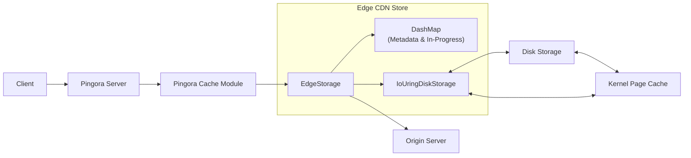
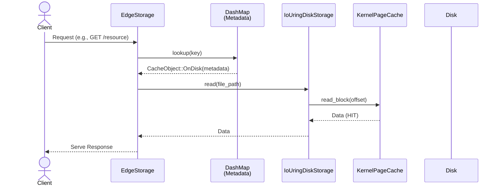
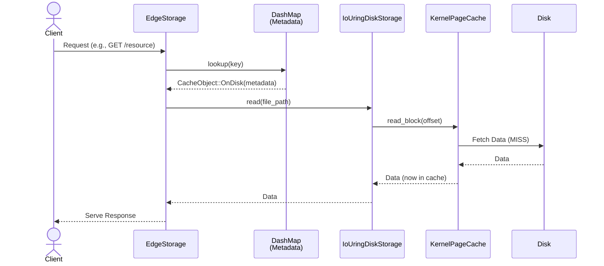

# Edge CDN Store Architecture and Sequence Diagrams

This document provides visual representations of the `edge-cdn-store` architecture and key request flows.

## 1. Architecture Schematic

## 2. Sequence Diagrams

### 2.1. Scenario: Hit in Memory (Kernel Page Cache)

This diagram illustrates a request where the data is already present in the operating system's kernel page cache.

### 2.2. Scenario: Hit on Disk (Not in Kernel Page Cache Initially)

This diagram illustrates a request where the data is on disk but not yet in the kernel page cache.

### 2.3. Scenario: Miss and Loading Process

This diagram illustrates a cache miss, fetching from the origin, buffering in-progress data, and asynchronous writing to disk. It also shows a concurrent request for the same resource hitting the in-progress buffer.

